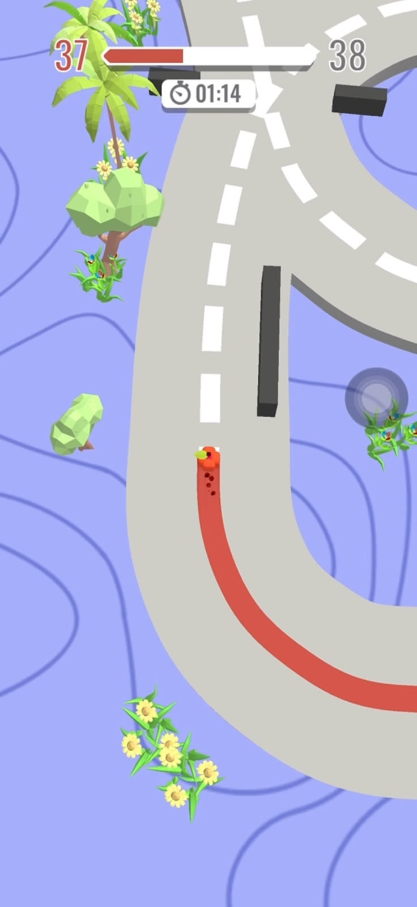

# CS464-A1-BSCS25132
# CS464 Assignment 01 · Muhammad Abdullah · BSCS-25132

## Game 1 · Color Adventure
- **App Store link:** https://apps.apple.com/pk/app/colour-adventure-draw-and-go/id1495787932
- **I played:** About 45 minutes plus and at level 37.
- **Video Link :** https://drive.google.com/file/d/1fyrIs7F9LTCbOWZORWv5gb5XmsN2qeVO/view?usp=sharing

1. [Pic01] · Showing auto closing/opening obstacle.
2. [Pic02] · Showing rotating incomplete circle obstacle.
3. [Pic03] · Showing player touch the obstacle and get turned into pieces. 
4. [Pic04] · showing straight line obstables when close immediately randomly. 

| # | Mechanic | Dynamic | Aesthetic | Bartle type |
|---|---|---|---|---|
| M1 | The cube moves while the player holds the screen and stops when the player lets go. | Players press and release again and again in small taps to move the cube slowly and carefully. | Sensation: the cube's moving sound is relaxing, so just moving feels nice. | Achiever |
| M2 | Some obstacles are rotating circles with a gap in them. The cube must pass through the gap. | Players stop and watch the circle turn, then move only when the gap comes near them. | Challenge: one wrong move breaks the cube, so passing the gap feels like a win. | Achiever |
| M3 | Black walls close by themselves after some time. | Players either rush through before the wall closes or wait for the next opening. | Challenge: it is a risk, so crossing the walls safely feels good. | Achiever |
| M4 | Straight obstacles rotate 90 degrees after a fixed time gap. | Players fail a few times, then learn the timing and use it to cross. | Discovery: players find out how the obstacle works by trying it. | Explorer |
| M5 | When the cube hits any obstacle, it breaks into many tiny pieces and the level restarts. | Players get trolled by the obstacles, laugh or get annoyed, and start the level again quickly. | Challenge: failing is easy, so finishing the level after many tries feels very good. | Achiever |
| M6 | Every level has a timer shown at the top of the screen. If the time ends, the cube breaks into pieces. | Players watch the timer and hurry, so they take risks instead of waiting safely. | Challenge: the countdown puts pressure on every move. | Achiever |
| M7 | After finishing some levels, the player can get a new cube design. | Players keep playing to see which new cube design they will get. | Expression: the player gets a new look for their own cube. | Achiever |

**Aesthetic profile:** Challenge is the biggest one (M2, M3, M5, M6). The game has many obstacles that break the cube, so finishing a level feels good. Sensation is second (M1), because the sound of the moving cube is relaxing and it makes me want to keep playing. Discovery also helps (M4), because I learn how each obstacle works by trying again and again.

**Player types**
- Primary: Achiever (acting × world), because the goal is to finish every level and beat every obstacle (M2, M3, M5, M6). I am acting on the game, not on other players. New cube designs are a reward for finishing levels (M7).
- Secondary: Explorer (interacting × world), because I watch how the rotating obstacles and walls move before I pass them (M4). I am interacting with the game's system, not with other players.

## Level blockouts
| Level | Screenshot | Its idea |
|---|---|---|
| Level01 |  | Its idea is from the color adventure game but i make it as a straight map where obstacle moving auto if script added cause the player to die when hitted.|
| Level02 |  | Its idea is from the color adventure game but i make it as a straight map where obstacle like walls and busses moving auto if script added cause the player to die when hitted.|
| Level03 |  | Its idea is from the color adventure game but i make it as a straight map where obstacle like walls and busses moving auto if script added cause the player to die when hitted.|

## Game 2 · Rolling Ball 3D
- **App Store link:** https://apps.apple.com/pk/app/rolling-sky-gyrosphere-game/id6741021412
- **I played:** For around 30-35 miuntes. Rn im at level 14 but it has option or hard level which i player the most.
- **Video Link :** https://drive.google.com/file/d/1sFNQIIup5TSjqVAZXpxHOG1iQKEHAAKv/view?usp=sharing

1. [Pic01] · Showing level 7 where ball moving on pipes track.
2. [Pic02] · Showing turned road and coins collecting scenerio.
3. [Pic03] · Showing ball is about to go down and then complete the level.
4. [Pic04] · Showing the wall obstacle i front of the ball which we can break by swiping faster.

| # | Mechanic | Dynamic | Aesthetic | Bartle type |
|---|---|---|---|---|
| M1 | The player swipes on the screen to move the ball. | Players swipe slowly near edges and swipe fast when they need speed. | Challenge: the ball only goes where my swipe sends it, so I have to control it well. | Achiever |
| M2 | Some walls on the path are made of cubes. A fast swipe breaks the wall into pieces, and the ball does not die. | Players swipe fast on purpose to smash through the wall instead of going around. | Sensation: breaking the wall into many pieces feels good. | Achiever |
| M3 | The ball dies only when it falls off the path, and then the level restarts. | Players move carefully near the edge, and restart quickly after a fall. | Challenge: one fall ends the try, so reaching the end feels like a win. | Achiever |
| M4 | Some platforms move by themselves after a fixed time. | Players wait and watch the platform, and swipe only when it comes close. | Challenge: bad timing means a fall. | Achiever |
| M5 | Some platforms move only when the ball's weight is on them, like in real life, and they can make the ball fall. | Players find out which platforms are risky and cross them carefully or quickly. | Discovery: I learn how the platform reacts by trying it. | Explorer |
| M6 | At big gaps, the swipe must have the right speed. A swipe that is too fast sends the ball past the platform and it falls, and a swipe that is too slow makes it fall short. | Players fail many times and try again until they find the right swipe strength. | Challenge: it needs exact control, so a perfect jump feels great. | Achiever |
| M7 | Coins are collected on the path, and finishing a level gives a new ball skin. | Players keep finishing levels to get new skins and collect coins on the way. | Expression: I get a new look for my ball. | Achiever |

**Aesthetic profile:** Challenge is the biggest one (M1, M3, M4, M6). One wrong swipe makes the ball fall, so finishing a level feels good. Sensation is second (M2), because breaking the cube walls feels satisfying. Discovery (M5) and Expression (M7) also help a little.

**Player types**
- Primary: Achiever (acting × world), because the goal is to reach the finish line of every level and beat the obstacles (M3, M4, M6). I am acting on the game, not on other players. New skins reward finishing levels (M7).
- Secondary: Explorer (interacting × world), because I find out how the weight platforms and swipe speed work by trying them (M5, M6). I am interacting with the game's system, not with other players.

## Level blockouts
| Level | Screenshot | Its idea |
|---|---|---|
| Level01 |  | Its idea is same a rolling ball like player have to complete the level without falling.|
| Level02 |  | In level 2 player has to go through the sharp turn and obstacles without falling to complete the level. |
| Level03 |  | In this level player has to go through the obstacle in previous level + the gap between the platform but moving the ball quickly and at exact speed speed without falling to complete level. |
