# CS464-A1-BSCS25132
# CS464 Assignment 01 · Muhammad Abdullah · BSCS-25132

## Game 1 · Color Adventure
- **App Store link:** https://apps.apple.com/pk/app/subway-surfers/id512939461
- **How much I played:** I spent my childhood with this game, so playing it brings back a lot of nostalgia.
- **Video Link :** 

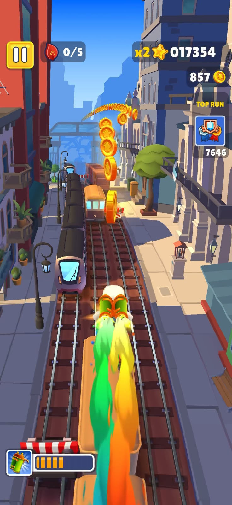
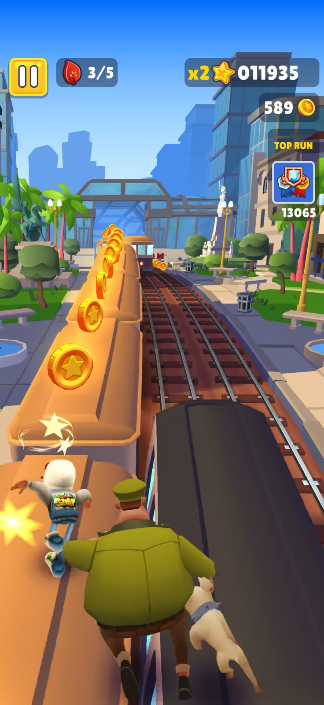
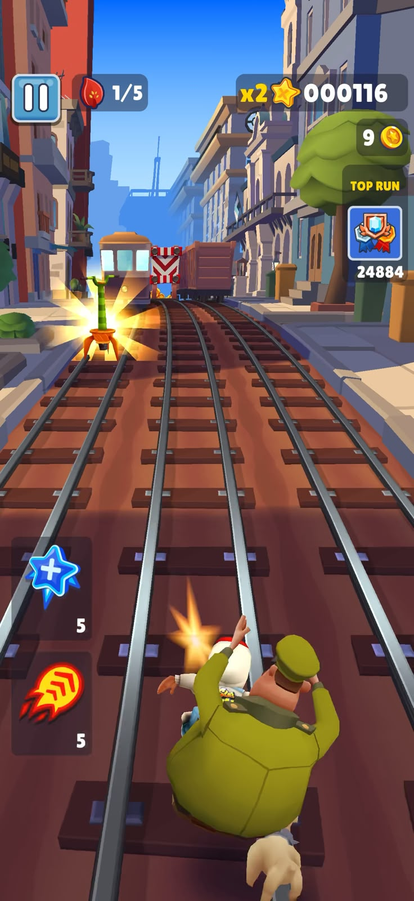

1. [Pic01] · Showing player is flying and is collecting the coins.
2. [Pic02] · Showing guard is chasing player and is runnig on the train.
3. [Pic03] · Showing guard is about to pick up the player but soon he is gonna pich flying jumper. 

| # | Mechanic | Dynamic | Aesthetic | Bartle type |
|---|---|---|---|---|
| M1 | The track has 3 lanes. Swipe to change lane, jump or roll. | Players switch lanes fast to miss obstacles. | Challenge: the game gets fast, so I must swipe right. | Achiever |
| M2 | The first hit makes the runner trip. The second hit ends the run. | Players try hard not to get hit even once. | Challenge: one mistake can end the run, so a long run feels good. | Achiever |
| M3 | Players collect coins and use them to buy new characters and boards. | Players go to risky lanes to get more coins. | Expression: I use coins to change my runner's look. | Achiever |
| M4 | A hoverboard saves the runner from one crash. Then it breaks. | Players use it when the track gets hard. | Challenge: one extra chance makes players take more risks. | Achiever |
| M5 | Power-ups like the jetpack and magnet work for a short time. | Players collect coins fast before the power-up ends. | Sensation: flying with the jetpack feels exciting. | Achiever |
| M6 | Missions give rewards and raise the score multiplier. | Players play in a new way to finish a mission. | Challenge: small goals make me play one more run. | Achiever |
| M7 | The game shows friends' best scores. | Players play again to beat a friend's score. | Fellowship: I compete with my friends. | Killer |

**Aesthetic profile:** Challenge is the biggest one (M1, M2, M4, M6). The game is fast and one mistake ends the run. Expression is second (M3), because coins buy new looks. Sensation also helps (M5), because power-ups feel exciting.

**Player types**
- Primary: Achiever (acting × world), because I want to run far, get coins and finish missions (M1, M2, M3, M6). I act on the game, not on other players.
- Secondary: Killer (acting × players), because I try to beat my friends' scores (M7).

## Level blockouts
| Level | Screenshot | Its idea |
|---|---|---|
| Level01 | 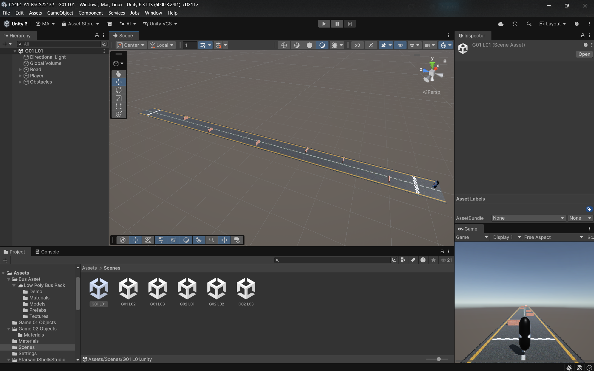 | Its idea is from the color adventure game but i make it as a straight map where obstacle moving auto if script added cause the player to die when hitted.|
| Level02 | 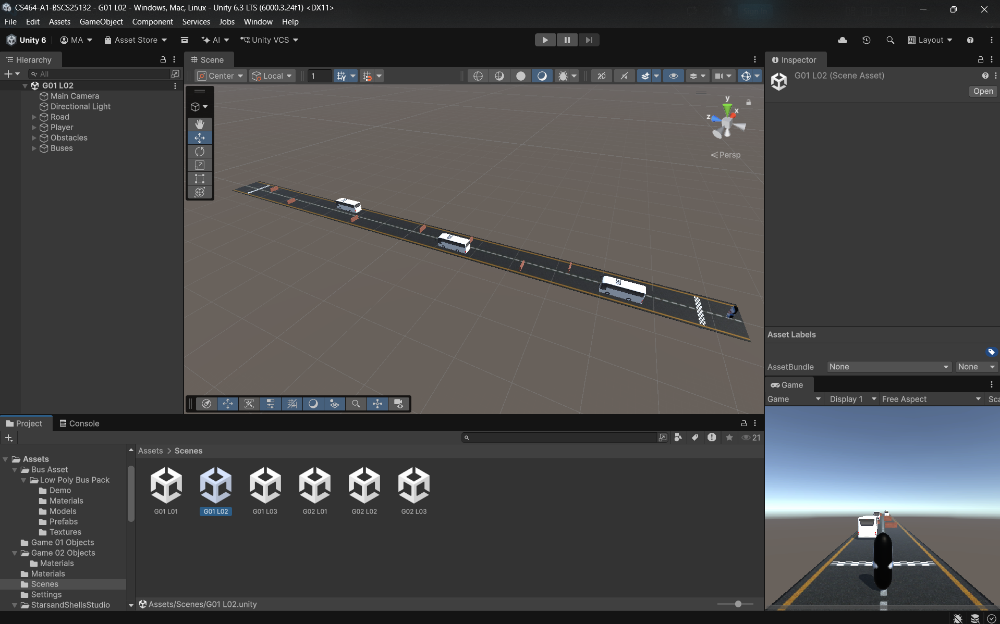 | Its idea is from the color adventure game but i make it as a straight map where obstacle like walls and busses moving auto if script added cause the player to die when hitted.|
| Level03 | 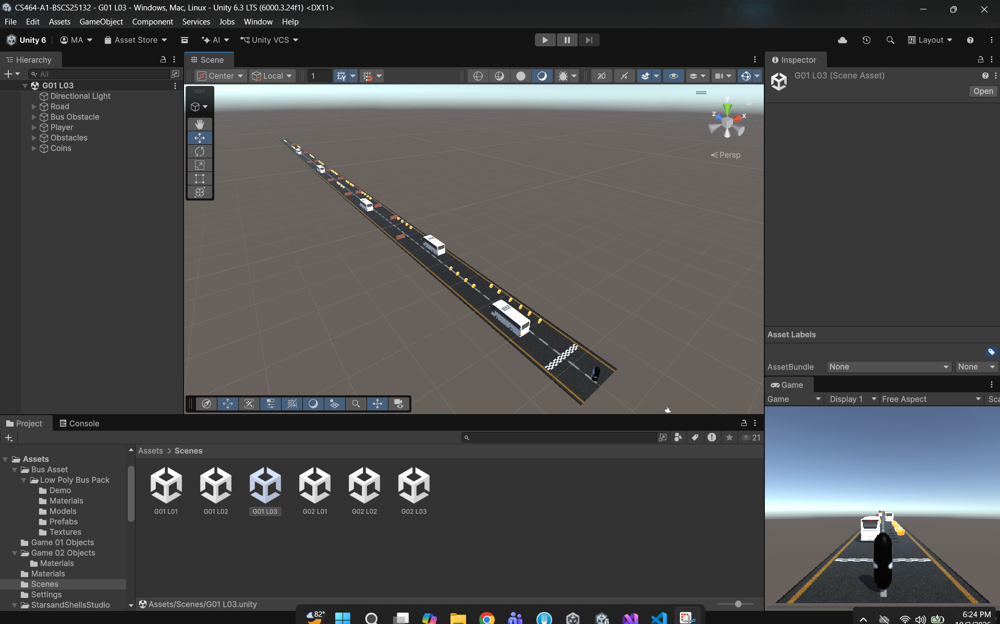 | Its idea is from the color adventure game but i make it as a straight map where obstacle like walls and busses moving auto if script added cause the player to die when hitted.|

## Game 2 · Rolling Ball 3D
- **App Store link:** https://apps.apple.com/pk/app/rolling-sky-gyrosphere-game/id6741021412
- **I played:** For around 30-35 miuntes. Rn im at level 14 but it has option or hard level which i player the most.
- **Video Link :** https://drive.google.com/file/d/1sFNQIIup5TSjqVAZXpxHOG1iQKEHAAKv/view?usp=sharing

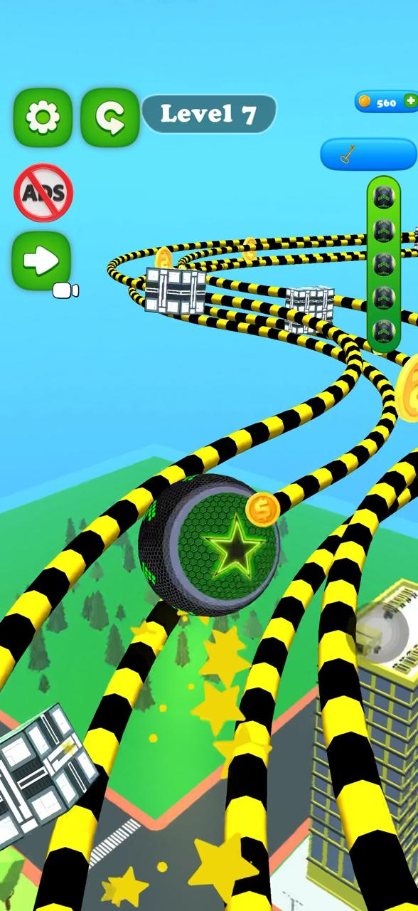
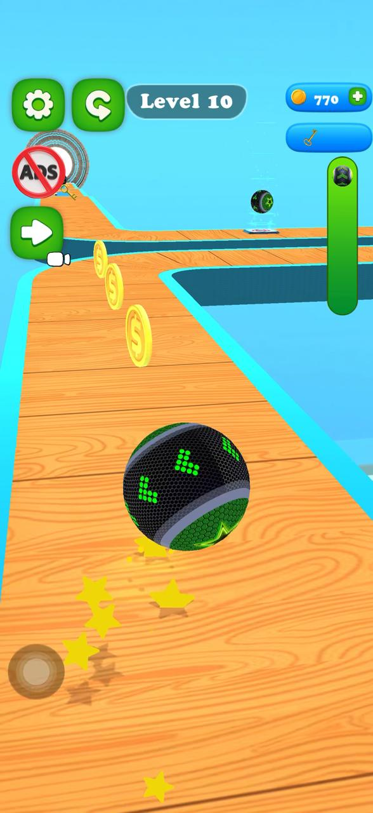
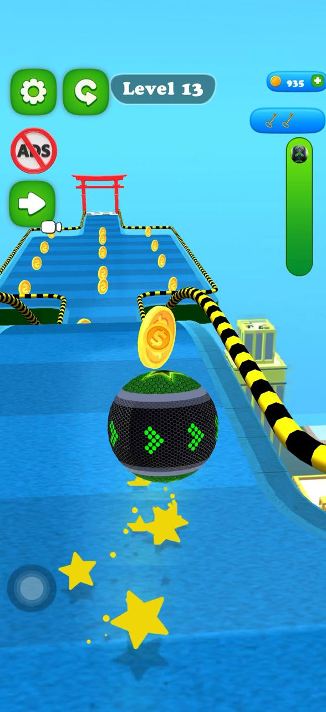
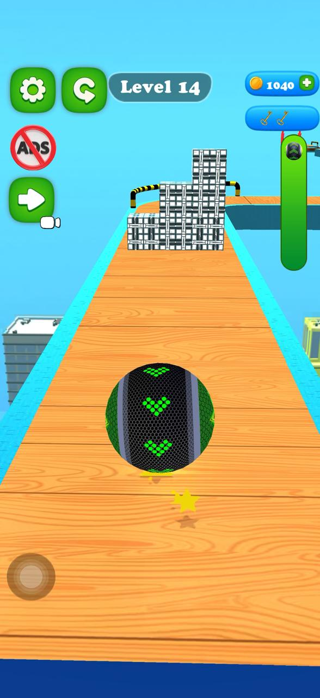

1. [Pic01] · Showing level 7 where ball moving on pipes track.
2. [Pic02] · Showing turned road and coins collecting scenerio.
3. [Pic03] · Showing ball is about to go down and then complete the level.
4. [Pic04] · Showing the wall obstacle i front of the ball which we can break by swiping faster.

| # | Mechanic | Dynamic | Aesthetic | Bartle type |
|---|---|---|---|---|
| M1 | The player swipes on the screen to move the ball. | Players swipe slowly near edges and swipe fast when they need speed. | Challenge: the ball only goes where my swipe sends it, so I have to control it well. | Achiever |
| M2 | Some walls on the path are made of cubes. A fast swipe breaks the wall into pieces, and the ball does not die. | Players swipe fast on purpose to smash through the wall instead of going around. | Sensation: breaking the wall into many pieces feels good. | Achiever |
| M3 | The ball dies only when it falls off the path, and then the level restarts. | Players move carefully near the edge, and restart quickly after a fall. | Challenge: one fall ends the try, so reaching the end feels like a win. | Achiever |
| M4 | Some platforms move by themselves after a fixed time. | Players wait and watch the platform, and swipe only when it comes close. | Challenge: bad timing means a fall. | Achiever |
| M5 | Some platforms move only when the ball's weight is on them, like in real life, and they can make the ball fall. | Players find out which platforms are risky and cross them carefully or quickly. | Discovery: I learn how the platform reacts by trying it. | Explorer |
| M6 | At big gaps, the swipe must have the right speed. A swipe that is too fast sends the ball past the platform and it falls, and a swipe that is too slow makes it fall short. | Players fail many times and try again until they find the right swipe strength. | Challenge: it needs exact control, so a perfect jump feels great. | Achiever |
| M7 | Coins are collected on the path, and finishing a level gives a new ball skin. | Players keep finishing levels to get new skins and collect coins on the way. | Expression: I get a new look for my ball. | Achiever |

**Aesthetic profile:** Challenge is the biggest one (M1, M3, M4, M6). One wrong swipe makes the ball fall, so finishing a level feels good. Sensation is second (M2), because breaking the cube walls feels satisfying. Discovery (M5) and Expression (M7) also help a little.

**Player types**
- Primary: Achiever (acting × world), because the goal is to reach the finish line of every level and beat the obstacles (M3, M4, M6). I am acting on the game, not on other players. New skins reward finishing levels (M7).
- Secondary: Explorer (interacting × world), because I find out how the weight platforms and swipe speed work by trying them (M5, M6). I am interacting with the game's system, not with other players.

## Level blockouts
| Level | Screenshot | Its idea |
|---|---|---|
| Level01 | 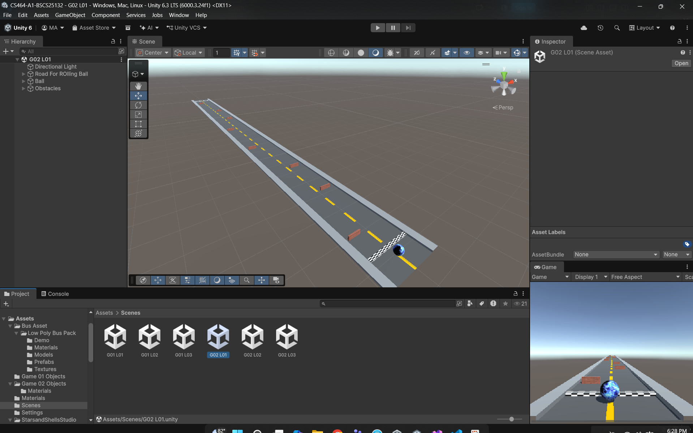 | Its idea is same a rolling ball like player have to complete the level without falling.|
| Level02 | 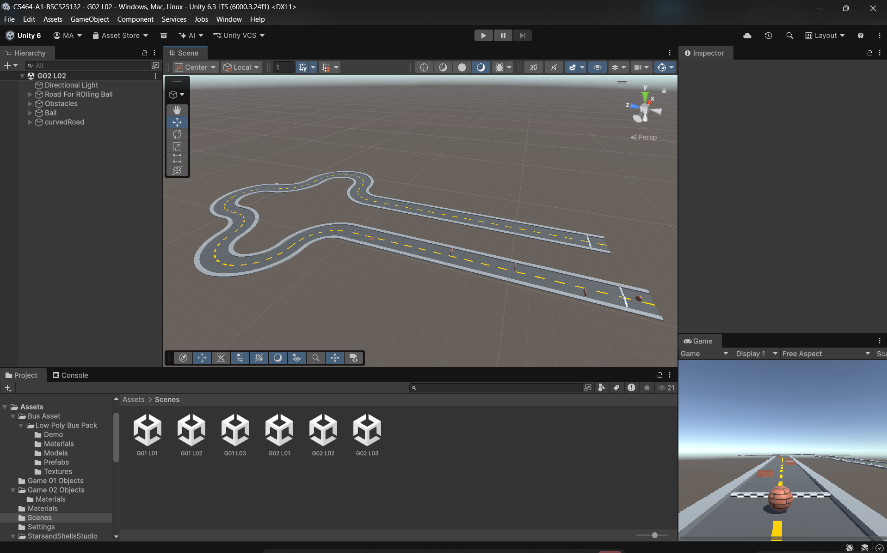 | In level 2 player has to go through the sharp turn and obstacles without falling to complete the level. |
| Level03 | 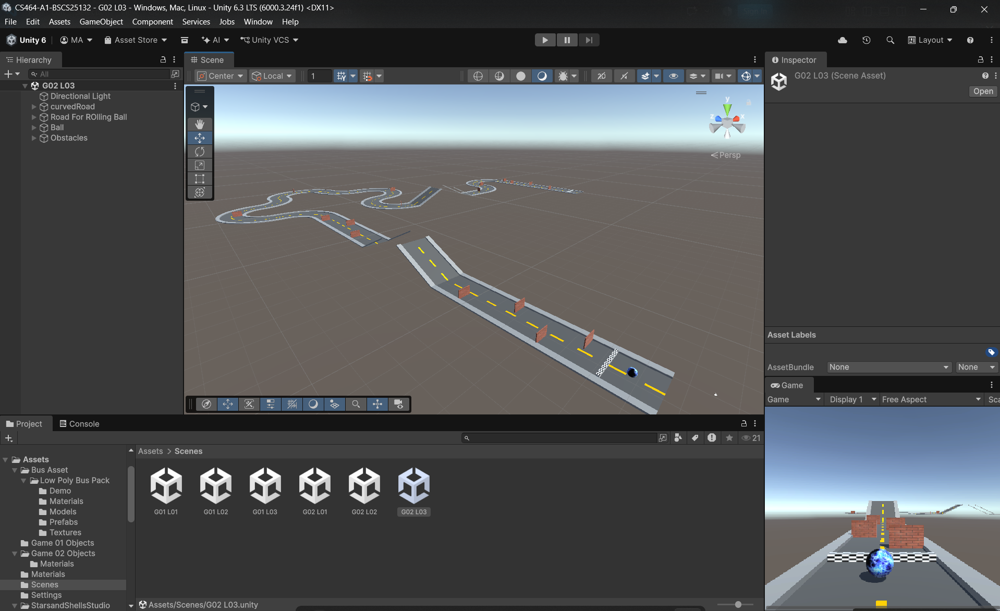 | In this level player has to go through the obstacle in previous level + the gap between the platform but moving the ball quickly and at exact speed speed without falling to complete level. |
